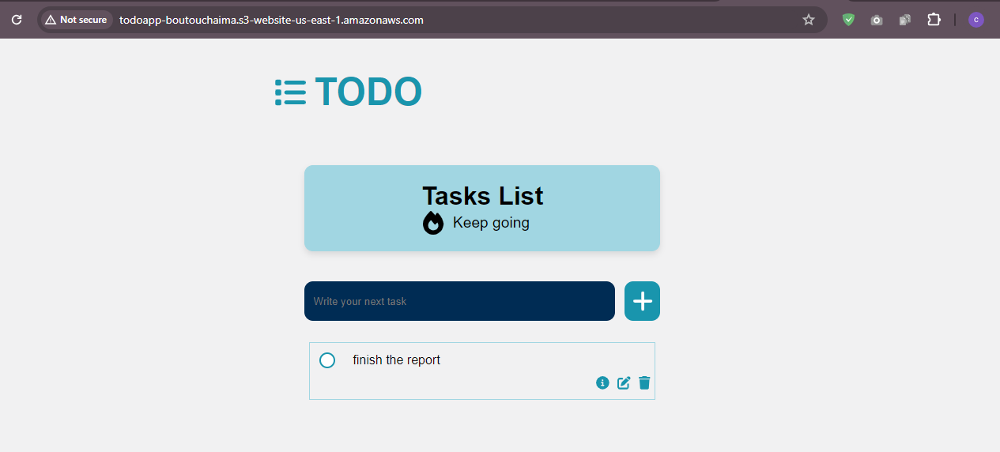

# To-Do App

A robust and user-friendly To-Do application built with React for the frontend and AWS Lambda for the backend. This application allows users to manage their tasks efficiently with features like adding, editing, completing, and deleting tasks. The app is hosted on Amazon S3.

## Features

- **Add Tasks:** Create new tasks with a title and description.
- **Edit Tasks:** Update existing tasks.
- **Complete Tasks:** Mark tasks as complete or incomplete.
- **Delete Tasks:** Remove tasks that are no longer needed.


## Technologies Used

- **Frontend:** React JS
- **Backend:** AWS Lambda, API Gateway
- **Hosting:** Amazon S3
- **Icons:** FontAwesome

## Live Demo

Check out the live demo of the application [here](http://todoapp-boutouchaima.s3-website-us-east-1.amazonaws.com).

## Screenshots




## Getting Started

Follow these instructions to set up the project locally for development and testing purposes.

### Prerequisites

- Node.js
- npm (Node Package Manager)
- AWS CLI (for deployment)

### Installation

1. **Clone the repository:**

   ```bash
   git clone https://github.com/chaimaboutou/To_DO_App_Serverless.git
   cd TO_DO_App_Serverless
